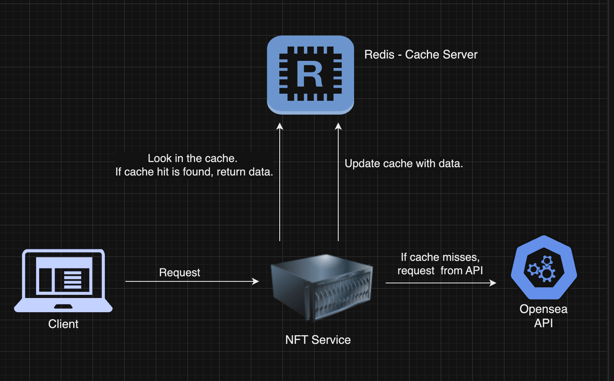
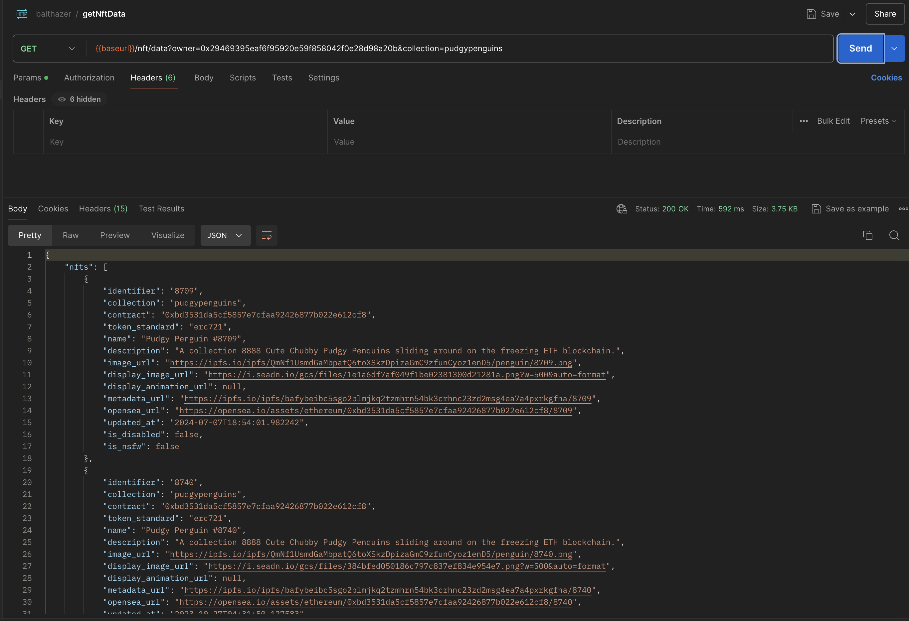
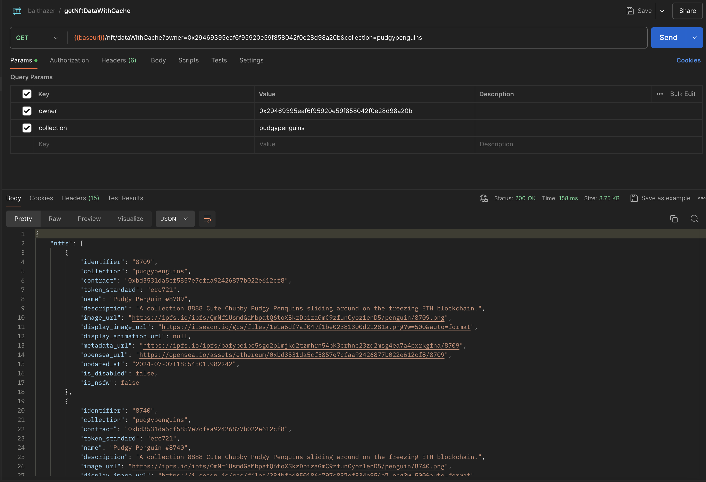

# Balthazar NFT Viewer - Backend

## Overview

Balthazar NFT Viewer is a web application that allows users to view NFT data for a given Ethereum wallet address and collection. This repository contains the backend service built with NestJS. The backend interacts with the OpenSea API to fetch NFT data and uses Redis for caching to enhance performance.

## High Level System Architecture



## Technologies and APIs

### Backend

- **NestJS**: A progressive Node.js framework for building efficient, reliable, and scalable server-side applications.
- **Axios**: A promise-based HTTP client for the browser and Node.js.
- **Redis**: An in-memory data structure store used as a cache to improve performance.

### APIs

- **OpenSea API**: Provides access to NFT data on the Ethereum blockchain.

## Instructions to Set Up and Run the Project

### Prerequisites

- Node.js (>= 14.x)
- npm (>= 6.x)
- Redis (for caching, optional)

### Installation

1. **Clone the Repository**

   ```bash
   git clone https://github.com/nuwanrg/balthazar-backend.git
   cd balthazar-backend
   ```

2. **Install Dependencies**

   ```bash
   npm install
   ```

3. **Set Up Environment Variables**

   Create a `.env` file in the `balthazar-backend` directory with the following content:

   ```plaintext
   OS_GET_NFT_URL=https://api.opensea.io/api/v2/chain/ethereum/account
   OS_API_KEY=your_opensea_api_key
   USE_CACHE=true
   REDIS_URL=redis://localhost:6379
   ```

   - **USE_CACHE**: Set this to `true` to enable caching with Redis. Set it to `false` to disable caching.

### Running the Project

1. **Run the Backend**

   ```bash
   npm run start
   ```

   The backend will be available at `http://localhost:3001`.

### Notes on the `USE_CACHE` Flag

- **USE_CACHE=true**: The backend will attempt to connect to the Redis server specified by `REDIS_URL` and use caching.
- **USE_CACHE=false**: The backend will not use Redis for caching, and all requests will fetch fresh data from the OpenSea API.

### Performance Test Cache enable

For testing purposes we used two endpoints to test performance. One endpoint uses caches while other is not.

Endpoint1 - Without Cache - /nft/data?owner=0x29469395eaf6f95920e59f858042f0e28d98a20b&collection=pudgypenguins
Response time :


Endpoint2 - With Cache - {{baseurl}}/nft/dataWithCache?owner=0x29469395eaf6f95920e59f858042f0e28d98a20b&collection=pudgypenguins
Response time ;


Conclusion : As

## Challenges Faced and How They Were Overcome

### CORS Issues

- **Challenge**: When integrating the frontend with the backend, CORS issues were encountered.
- **Solution**: Configured the backend to include CORS headers to allow requests from the frontend origin.

### Redis Integration

- **Challenge**: Handling the Redis connection and ensuring it only attempts to connect when caching is enabled.
- **Solution**: Used environment variables to conditionally initialize the Redis client, preventing connection attempts when caching is disabled.

### Environment Configuration

- **Challenge**: Managing different configurations for local development and production.
- **Solution**: Utilized `.env` files and the `ConfigModule` for environment-specific settings, ensuring smooth transitions between environments.

## Assumptions Made During Development

- **API Key Availability**: It is assumed that the user has a valid OpenSea API key for accessing the NFT data.
- **Redis Installation**: For local caching, it is assumed that Redis is installed and running on `localhost:6379`.
- **Ethereum Address Validity**: The backend includes basic validation for Ethereum addresses, assuming valid inputs from users.

## Conclusion

The Balthazar NFT Viewer backend service is a robust solution for fetching and caching NFT data. It demonstrates the use of NestJS for building scalable applications and highlights the benefits of caching with Redis.

Feel free to contribute or raise issues if you encounter any problems!

## License

This project is licensed under the MIT License. See the [LICENSE](LICENSE) file for details.

```

```
